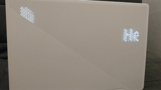

# ZephyrusBling

ZephyrusBling is a utility that can display text and images on the back of the
ASUS ROG Zephyrus G14 laptop using [rog-core](https://github.com/flukejones/rog-core).



## Features

- [X] Displaying images
- [X] Text rendering (with ImageMagick)
- [X] Animations with linear transforms (rotations, traslations and scaling only) and adjusting image brightness
- [ ] Aligning the text with grid for sharp letters
- [ ] Displaying desktop notifications
- [ ] Displaying battery status

## Compiling

The following libraries are used:
- Boost
- CLI11
- fmt
- glm
- GSL
- sdbus-c++

In ArchLinux, these are in the following packages: `boost`, `cli11` (from AUR), `fmt`,
`glm`, `microsoft-gsl`, `sdbus-cpp` (from AUR).

```
mkdir build
cd build
cmake .. --build
```

[rog-core](https://github.com/flukejones/rog-core) should also be running to actually
send the images to the LEDs, I have [patched](https://github.com/Meumeu/rog-core/tree/animatrix-smooth)
it to get smoother animations but the basic functionalities work with the upstream version.

## How to use

This assumes the rog-core service is started and you have the correct permissions.

From the build directory, start the DBus service:
```
./zephyrusbling --daemon
```

In another terminal, display an image or some text:
```
./zephyrusbling --text "Hello world" --fx translate:0,20,0:3,-25,0
./zephyrusbling --image tux.png --fx scale:0.8,0.8 --fx rotate:0,0:3,19 --fx translate:0,-20,0:3,20,0
```

By default, the text or image disappears after 3 seconds, use the `--duration`
option to override it.

Each `--fx` specifies a transform to apply, with the following format: `effect:params(:params)*`

Each `param` is a sequence of comma separated floating point numbers whose
meaning depends on the effect.

If only one `param` is given for the effect, it stays constant while the image
is displayed. If there are several, the first number of each `param` is a timestamp
since the image is first displayed and the others are the arguments. In the latter
case, the arguments are linearly interpolated with respect to time.

The effect can be:
- translate: the 2 arguments are the displacement in cm on the X and Y axes
- rotate: the argument is the angle in radian
- scale: the 2 arguments are the scaling factor on the X and Y axes
- brightness: the argument is a multiplier applied on the grey channel of the image
- alpha: the argument is a multiplier applied on the alpha channel of the image

For the moment the Z order is not implemented, so when several images overlap it
is not predictable which one is on top...
